Kubernetes Deployment Guide
This document explains how to deploy the PHP Todo web application and its MySQL database onto the Kubernetes cluster we prepared in the previous document.


1. Introduction
At this point, you should have a working Kubernetes cluster with 3 nodes (desktop-control-plane, desktop-worker, desktop-worker2).

We will now deploy our application. Our application consists of two main parts:

PHP Todo App (Frontend/Backend): The web application that users interact with.

MySQL Database: Where the Todo tasks are permanently stored.

To make this robust, we will deploy 3 replicas of the PHP app (so if one crashes, the app stays online) and 1 replica of MySQL (backed by persistent storage).

# 2.  Get the Application Source Code

The PHP Todo application is stored in GitHub.

Repository:

```text
https://github.com/Tamiru-Assefa/devops-php-todo
```

```bash
git clone https://github.com/Tamiru-Assefa/devops-php-todo.git
```

Then:

```bash
cd devops-php-todo
```

Verify the Kubernetes directory:

```bash
kubectl get nodes
```

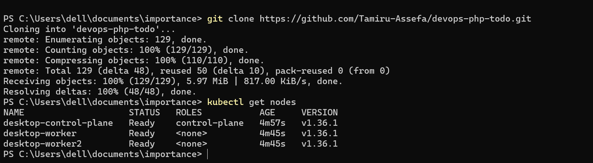

Later, Jenkins will clone the same repository automatically during the CI/CD pipeline.

---

# 3. Build Jenkins Container on the Control Plane

 So what we will do is build the DockerFile found in Jenkins directory.

 ```bash
cd Jenkins
docker build -t devops-jenkins:1.0
 ```


Next we build a volume for the Jenkins Container; incase the container fail the data like installed plugins and Job are not get lost. 

```bash
docker volume create jenkins_home
```
Next we run the container on the port 8081 which is forwarded to jenkins port 8080 and mount the volume.

```bash
docker run -d --name jenkins -p 8081:8080 -v jenkins_home:/var/jenkins_home devops-jenkins:1.0
```
---

# 4. 🌐 Verify Jenkins & Docker Login

Open Jenkins from your browser:

```text
http://<ip>:8081
```

Then login to jenkins(follow the instruction found on the ui).
Install suggested Plugins.

## Docker Hub Login
We have to Login to our dockerhub account so every build container are going to be stored on the remote repo. 
And we create credential token on dockerhub and connect it to our jenkins service. so Jenkins can push the images with out any barrier. 

```bash
docker login
```
---


here we build the img and push it to the repo


# 10.  Create the Kubernetes Namespace

Now we begin creating Kubernetes resources.

Creating devops-todo namespace. Namespace help us to logically separate this projects setup from the others.

```bash
kubectl apply -f Kubernetes/namespace.yaml
```

Verify:

```bash
kubectl get namespaces
```

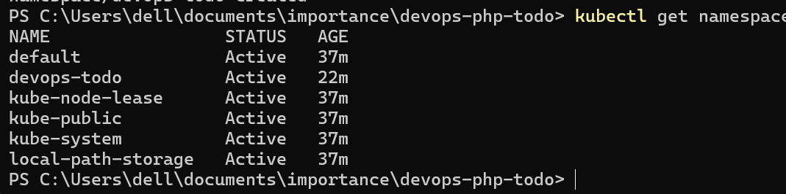

---

# 11.  Create the MySQL Secret

The database credentials should not be written directly into the application configuration.

Kubernetes Secrets allow us to store sensitive configuration separately.

Our Secret name will be:

```text
mysql-secret
```


```bash
kubectl create secret generic mysql-secret \
  --from-literal=MYSQL_ROOT_PASSWORD=rootpassword \
  --from-literal=MYSQL_USER=root \
  --from-literal=MYSQL_PASSWORD=rootpassword \
  -n devops-todo
```

Verify:

```bash
kubectl get secrets -n devops-todo
```
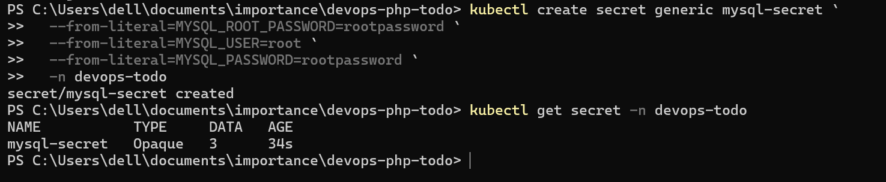

---


6. Deploy the PHP Application
Now we deploy the PHP app. Look at the deployment.yaml file. It contains instructions for Kubernetes. Let's apply it:

bash
kubectl apply -f Kubernetes/deployment.yaml
Expected Output: deployment.apps/todo-app created

⚙️ Understanding the Deployment Settings
In this file, we defined several important settings:

Replicas: 3: Kubernetes will create 3 identical copies (Pods) of your PHP container. If one fails, the other two keep the site running.

Resources:

requests: The minimum resources guaranteed to the container. (100m CPU = 10% of a core, 128Mi RAM).

limits: The maximum resources the container can use before it gets throttled or killed. (500m CPU = 50% of a core, 256Mi RAM).

ReadinessProbe: Kubernetes checks if the app is ready to receive traffic before sending users to it. It waits 5 seconds, then checks every 10 seconds.

LivenessProbe: Kubernetes checks if the app is still alive. If it freezes, Kubernetes will restart it. It waits 15 seconds, then checks every 20 seconds.

Verify the Pods are running:

bash
kubectl get pods -n devops-todo
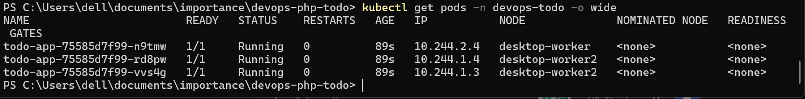


7. Expose the PHP Application (Service)
Right now, your PHP pods are running, but they are only accessible inside the cluster. To access them from your web browser, we need a Service.

We use a NodePort service, which opens a specific port on every node in the cluster (e.g., 30080) and forwards traffic to port 80 inside our containers.

Apply the service:

bash
kubectl apply -f Kubernetes/service.yaml
Expected Output: service/todo-service created

Verify the Service:

bash
kubectl get service -n devops-todo
You should see todo-service. Notice the PORT(S) column says 80:30080/TCP. This means port 80 inside the cluster is mapped to port 30080 on your local machine.
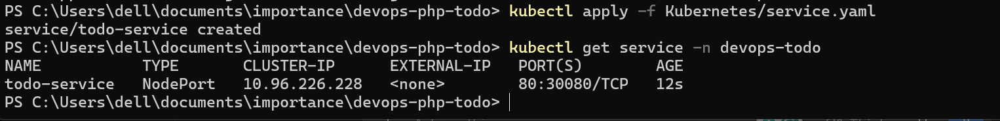

Check Endpoints:
A service routes traffic to specific Pod IPs. To verify it found our 3 PHP pods:

bash
kubectl get endpoints -n devops-todo

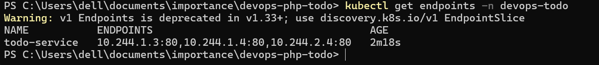

===================================================================================================
==========================================================================

8. Deploy MySQL Database and pvc
Now we need our database. We will deploy MySQL and a Service for it.
Note: We do not expose MySQL with a NodePort. It should only be accessible internally by our PHP app for security reasons.

First, we apply the PVC(volume) file. This asks Kubernetes to allocate 1 Gigabyte of storage for our database.

bash
kubectl apply -f Kubernetes/mysql-pvc.yaml


Verify the PVC is bound:

bash
kubectl get pvc -n devops-todo
You should see mysql-pvc with a STATUS of Bound. This means Kubernetes successfully found and attached the storage.

Apply the MySQL deployment and service:

bash
kubectl apply -f Kubernetes/mysql-deployment.yaml
kubectl apply -f Kubernetes/mysql-service.yaml


Verify MySQL is running:

bash
kubectl get pods -n devops-todo
You should now see a mysql-xxxxx pod running alongside your 3 PHP pods.

# Jenkins SetUp
Go to your browser Jenkins: ip:8081
create new job make sure you select pipline job and name it 'devops-php-todo'
and then check the github under resource and paste you github repo link
and under check scm poll git and make the branch */main and then the jenkins file path which is our located under root directory. 
our jenkins what it will do is as it stated under jenkinsfile. it check scm and then build an img root img from our local or if not there get it from our dockerhub, then login to dockerhub then push the img with version attached on it which is the build number i use, and then set the build img of the k8s to the new one and finally logout to dockerhub. 

so and then click build now and check the log for sucessmessage if it sucesses check your dockerhub account if the new push exsist. 


# 📊 Monitoring Setup: Prometheus, Grafana, cAdvisor & Kubernetes Metrics

This document explains how to build a complete monitoring stack for the Kubernetes cluster hosting the PHP Todo application.

The monitoring architecture uses:

* **Prometheus** — collects and stores time-series metrics
* **Grafana** — visualizes metrics through dashboards
* **cAdvisor** — collects container CPU, memory, filesystem, and network metrics
* **kube-state-metrics** — exposes Kubernetes object/state metrics such as Deployment replicas, Pod status, and desired/current replica counts

The final monitoring architecture is:

```text
                         Kubernetes Cluster
                                │
             ┌──────────────────┼──────────────────┐
             │                  │                  │
             ▼                  ▼                  ▼
     desktop-control-plane  desktop-worker   desktop-worker2
        192.168.1.10         192.168.1.11      192.168.1.12
             │                  │                  │
             │                  │                  │
             |            cAdvisor            cAdvisor
             │                  │                  │
             └──────────────────┼──────────────────┘
                                │
                                ▼
                         Prometheus
                                │
                                │ PromQL
                                ▼
                            Grafana
                                │
                                ▼
                         Web Dashboard
```

---

# 1. Monitoring Architecture

The monitoring stack contains several different responsibilities.

## Prometheus

Prometheus periodically **scrapes** metrics from monitoring endpoints and stores them as time-series data.

For example:

```text
CPU usage
Memory usage
Pod count
Container statistics
Deployment replicas
Node metrics
```

Prometheus does not normally receive metrics automatically.

Instead, it asks monitoring endpoints:

```text
Prometheus
    │
    ├── scrape ──► cAdvisor
    │
    ├── scrape ──► kube-state-metrics
    │
    └── scrape ──► Kubernetes / node endpoints
```

---

# 2. cAdvisor vs kube-state-metrics

These two components solve different problems.

## cAdvisor

cAdvisor provides **container resource metrics**, such as:

```text
CPU usage
Memory usage
Network traffic
Filesystem usage
Container statistics
```

For example:

```text
container_cpu_usage_seconds_total
container_memory_working_set_bytes
```

These are useful for questions such as:

> How much CPU is my PHP container using?

---

## kube-state-metrics

kube-state-metrics exposes information about the **state of Kubernetes objects**.

For example:

```text
Deployment desired replicas
Deployment available replicas
Pod status
DaemonSet status
Node status
```

This provides metrics such as:

```text
kube_deployment_status_replicas_available
```

Therefore, our monitoring stack uses:

```text
cAdvisor
     ↓
Container-level metrics

kube-state-metrics
     ↓
Kubernetes object/state metrics
```

---


# 5. Create the Monitoring Namespace

We isolate monitoring components from the application.

The PHP Todo application runs in:

```text
devops-todo
```

Monitoring runs in:

```text
monitoring
```

This separation makes the cluster easier to organize.

## Run on: `desktop-control-plane`

Create the namespace:

```bash
kubectl create namespace monitoring
```


Verify:

```bash
kubectl get namespaces
```


---

# 6. Monitoring Kubernetes Files

The Kubernetes directory should contain monitoring manifests similar to:

```text
Kubernetes/
│
├── prometheus-rbac.yaml
├── prometheus-config.yaml
├── prometheus-deployment.yaml
├── prometheus-service.yaml
│
├── grafana-deployment.yaml
├── grafana-service.yaml
│
├── cadvisor.yaml
│
├── kube-state-metrics.yaml
│
└── ...
```

If persistent storage is configured separately, you may also have:

```text
├── prometheus-pvc.yaml
└── grafana-pvc.yaml
```

---

# 7. Deploy Prometheus RBAC

Prometheus needs permission to discover Kubernetes resources.

RBAC stands for:

```text
Role-Based Access Control
```

Prometheus uses Kubernetes API access for service discovery and monitoring.

The RBAC manifest normally creates:

```text
ServiceAccount
ClusterRole
ClusterRoleBinding
```

## Run on: `desktop-control-plane`

```bash
kubectl apply -f Kubernetes/prometheus-rbac.yaml
```

Verify:

```bash
kubectl get serviceaccount -n monitoring
```

Check ClusterRoles:

```bash
kubectl get clusterrole | grep prometheus
```

Check bindings:

```bash
kubectl get clusterrolebinding | grep prometheus
```

---

# 8. Configure Prometheus

The Prometheus configuration is normally stored inside a ConfigMap.

The configuration file is:

```text
prometheus.yml
```

It defines:

* Scrape interval
* Scrape targets
* Kubernetes service discovery
* cAdvisor targets
* kube-state-metrics targets
* Other monitoring endpoints

```bash
kubectl apply -f Kubernetes/prometheus-config.yaml
```

Verify:

```bash
kubectl get configmap -n monitoring
```

You should see:

```text
prometheus-config
```

You can inspect it with:

```bash
kubectl get configmap prometheus-config \
  -n monitoring \
  -o yaml
```

---

# 9. Deploy Prometheus

The Prometheus Deployment creates the Prometheus Pod.


```bash
kubectl apply -f Kubernetes/prometheus-deployment.yaml
```

Verify:

```bash
kubectl get deployments -n monitoring
```


Check the Pod:

```bash
kubectl get pods -n monitoring -o wide
```


# 11. Expose Prometheus

Create the Prometheus Service:


```bash
kubectl apply -f Kubernetes/prometheus-service.yaml
```

Verify:

```bash
kubectl get service -n monitoring
```


The mapping:

```text
9090:30090/TCP
```

means:

```text
Container/Service Port: 9090
NodePort:              30090
```
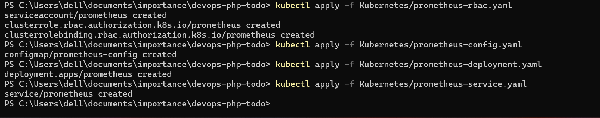
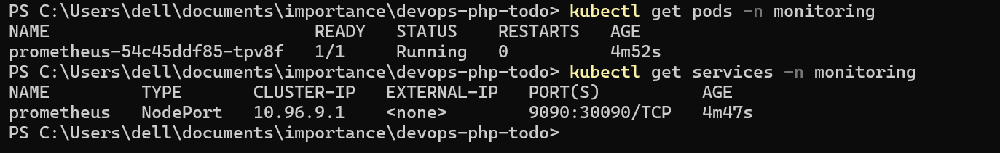
---

# 12. Access Prometheus

From your computer's browser:

```text
http://ip-server-1:30090
```

You can also try:

```text
http://ip-server-2:30090
```

or:

```text
http://ip-server-3:30090
```

The Prometheus interface should open.

---

# 13. Verify Prometheus Targets

Inside the Prometheus web interface, go to:

```text
Status
    ↓
Targets
```

You should see your configured monitoring targets.

The important thing is that targets should eventually show:

```text
UP
```

If a target shows:

```text
DOWN
```
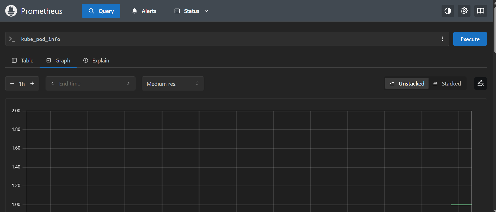

do not continue directly to Grafana.

First investigate the failed target.

---

# 14. Deploy kube-state-metrics

This component is important for Kubernetes-level metrics.

Without kube-state-metrics, queries such as:

```promql
kube_deployment_status_replicas_available
```

may return no data.


```bash
kubectl apply -f Kubernetes/kube-state-metrics.yaml
```

Verify:

```bash
kubectl get pods -n monitoring
```

You should see a Pod similar to:

```text
kube-state-metrics-xxxxx   1/1   Running
```

Verify its Service:


---

# 15. Verify kube-state-metrics

Check the Service:

```bash
kubectl get svc kube-state-metrics -n monitoring
```

Typically it exposes port:

```text
8080
```

Prometheus should be configured to scrape:

```text
kube-state-metrics:8080
```

Because both services are in the `monitoring` namespace, the short DNS name works:

```text
kube-state-metrics:8080
```

---

# 16. Deploy cAdvisor

cAdvisor collects container-level resource metrics.

It should normally run as a:

```text
DaemonSet
```

A DaemonSet tells Kubernetes:

> Run one Pod on every eligible node.

This is important because container metrics are generated locally on each node.

---

# 17. Important cAdvisor Node Consideration

Your cluster contains:

```text
desktop-control-plane
desktop-worker
desktop-worker2
```

However, kubeadm control-plane nodes normally have a taint that prevents ordinary workloads from being scheduled there.

Therefore

```text
desktop-worker
desktop-worker2
```

but not:

```text
desktop-control-plane
```

If you want cAdvisor to monitor **all three nodes**, including the control plane, the DaemonSet needs an appropriate toleration for the control-plane taint.

Do not simply assume that:

```text
DaemonSet = three Pods
```

Always verify the actual result.

---

# 18. Deploy cAdvisor

## Run on: `desktop-control-plane`

```bash
kubectl apply -f Kubernetes/cadvisor.yaml
```

Check the DaemonSet:

```bash
kubectl get daemonset -n monitoring
```

Expected example:

```text
NAME       DESIRED   CURRENT   READY
cadvisor   2         2         2
```


---

# 19. Check Which Nodes Run cAdvisor

This is important.


```bash
kubectl get pods -n monitoring -o wide
```

Example:

```text
NAME              READY   STATUS    NODE
cadvisor-xxxxx    1/1     Running   desktop-worker
cadvisor-yyyyy    1/1     Running   desktop-worker2
```


---

# 20. Why cAdvisor Runs on Multiple Nodes

Suppose:

```text
desktop-worker
```

is running:

```text
PHP Pod A
PHP Pod B
```

and:

```text
desktop-worker2
```

is running:

```text
PHP Pod C
```

Each node has its own containers.

Therefore:

```text
desktop-worker
      ↓
cAdvisor
      ↓
container metrics

desktop-worker2
      ↓
cAdvisor
      ↓
container metrics
```

Prometheus collects the metrics from the cAdvisor instances.

---

# 21. Verify cAdvisor Metrics

Check the cAdvisor Service:

```bash
kubectl get service -n monitoring
```

You should see:

```text
cadvisor
```

You can also inspect the endpoints:

```bash
kubectl get endpoints -n monitoring cadvisor
```

The endpoints should correspond to the available cAdvisor Pods.

---

# 22. Deploy Grafana

Grafana is the visualization layer.

It does not normally collect metrics itself.

Instead:

```text
cAdvisor
      ↓
Prometheus
      ↓
Grafana
```

Grafana sends PromQL queries to Prometheus.


```bash
kubectl apply -f Kubernetes/grafana-deployment.yaml
```

Verify:

```bash
kubectl get deployment -n monitoring
```


---


# 24. Expose Grafana

Apply the Service:

```bash
kubectl apply -f Kubernetes/grafana-service.yaml
```

Verify:

```bash
kubectl get service -n monitoring
```


---

# 25. Access Grafana

Open:

```text
http://ip-of-any-server:30300
```


---

# 26. Grafana Login

The initial credentials are:

```text
Username:
admin

Password:
admin
```


After logging in, change the default password.


---

# 27. Persistent Grafana Storage

Grafana stores important information such as:

```text
Dashboards
Data source configuration
Users
Plugins
Grafana settings
```


# 30. Connect Grafana to Prometheus

Log into Grafana.

Navigate to:

```text
Connections
    ↓
Data sources
```

Click:

```text
Add data source
```

Select:

```text
Prometheus
```

For the URL, use the Kubernetes Service name.


use:

```text
http://prometheus:9090
```

This works because Kubernetes provides internal DNS.

The flow is:

```text
Grafana
   │
   │ http://prometheus:9090
   ▼
Prometheus Service
   │
   ▼
Prometheus Pod
```

Click:

```text
Save & Test
```

You should receive a successful connection message.

---


# 32. Verify the Prometheus Data Source

In Grafana:

```text
Connections
    ↓
Data sources
    ↓
Prometheus
```

Click:

```text
Save & Test
```

The connection should succeed.

If it fails, verify:

```bash
kubectl get svc prometheus -n monitoring
```

and:

```bash
kubectl get pods -n monitoring
```

---

# 33. Test Prometheus Before Building Dashboards

Before creating Grafana panels, verify that Prometheus actually has data.

Open Prometheus:

```text
http://ip:30090
```

Go to:

```text
Graph
```

Try:

```promql
up
```

Click:

```text
Execute
```

You should receive time-series results.

This confirms Prometheus is collecting metrics.

---

# 34. Test Container Metrics

Run:

```promql
container_cpu_usage_seconds_total
```

If cAdvisor is being successfully scraped, this query should return container metrics.

You can also test:

```promql
container_memory_working_set_bytes
```
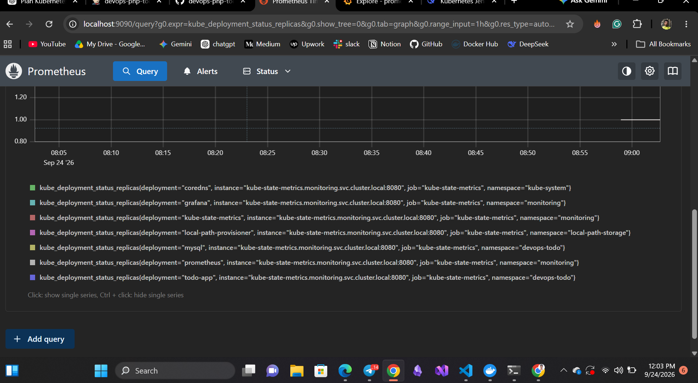
---

# 35. Test Kubernetes State Metrics

Run:

```promql
kube_deployment_status_replicas_available
```

If kube-state-metrics is correctly deployed and scraped, Kubernetes Deployment metrics should appear.

Test specifically:

```promql
kube_deployment_status_replicas_available{
  namespace="devops-todo",
  deployment="todo-app"
}
```

You should get the currently available PHP replicas.

---

# 36. Create the Grafana Dashboard

In Grafana:

```text
Dashboards
    ↓
New
    ↓
New Dashboard
```

Click:

```text
Add visualization
```

Select:

```text
Prometheus
```

We will create four main panels.


---

# 37. Panel 1 — PHP Todo CPU Usage

This panel shows CPU consumption of the PHP Todo Pods.

Use:

```promql
sum by (pod) (
  rate(container_cpu_usage_seconds_total{
    namespace="devops-todo",
    container!="",
    container!="POD"
  }[5m])
)
```

Select:

```text
Visualization:
Time series
```

Title:

```text
PHP Todo CPU Usage
```

Recommended unit:

```text
CPU
```

or:

```text
Percent (0.0-1.0)
```

depending on how you want the value displayed.

---


# 39. Panel 2 — PHP Todo Memory Usage

Create another visualization.

Use:

```promql
sum by (pod) (
  container_memory_working_set_bytes{
    namespace="devops-todo",
    container!="",
    container!="POD"
  }
)
```

Visualization:

```text
Time series
```

Title:

```text
PHP Todo Memory Usage
```

Set the unit to:

```text
Data (IEC)
```

and:

```text
bytes
```

This allows Grafana to display values such as:

```text
50 MiB
100 MiB
250 MiB
```

instead of large raw byte numbers.

---

# 40. Understanding the Memory Query

The metric:

```text
container_memory_working_set_bytes
```

represents the current working memory set of the container.

We group it:

```promql
sum by (pod)
```

so each PHP Pod gets its own series.

This lets you identify whether one replica is consuming significantly more memory than the others.
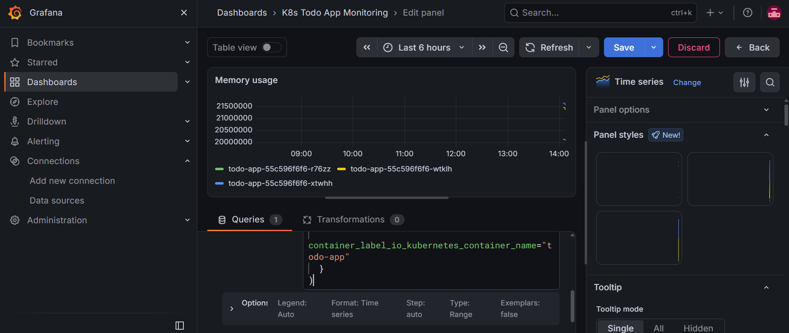

---

# 41. Panel 3 — Current CPU Usage by Pod

Create another visualization.

Use:

```promql
sum by (pod) (
  rate(container_cpu_usage_seconds_total{
    namespace="devops-todo",
    container!="",
    container!="POD"
  }[5m])
)
```

Visualization:

```text
Bar chart
```

Title:

```text
Current CPU Usage by Pod
```

This gives you an easier comparison between the PHP replicas.

Example:

```text
todo-app-aaa   █████
todo-app-bbb   ███
todo-app-ccc   ███████
```

---

# 42. Panel 4 — Available PHP Replicas

This panel uses kube-state-metrics.

Use:

```promql
kube_deployment_status_replicas_available{
  namespace="devops-todo",
  deployment="todo-app"
}
```

Visualization:

```text
Time series
```

Title:

```text
Available PHP Replicas
```

The application is configured for:

```text
3 replicas
```

Therefore, under normal conditions, the metric should be:

```text
3
```

If it drops to:

```text
2
```

one replica is unavailable.

If it drops to:

```text
1
```

two replicas are unavailable.

If it reaches:

```text
0
```

the application has no available PHP replicas.


---

# 43. Add Desired Replica Count

A useful additional panel is to compare the desired and available replicas.

Desired replicas:

```promql
kube_deployment_spec_replicas{
  namespace="devops-todo",
  deployment="todo-app"
}
```

Available replicas:

```promql
kube_deployment_status_replicas_available{
  namespace="devops-todo",
  deployment="todo-app"
}
```

Use a:

```text
Time series
```

visualization.

Title:

```text
PHP Todo Desired vs Available Replicas
```

This makes Kubernetes availability easier to understand.

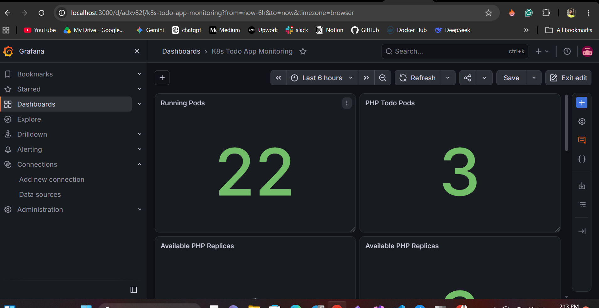

---


# 48. Save the Dashboard

You can add any kind of custom panel.
Once the panels are complete:

```text
Save dashboard
```

Use:

```text
K8s Todo App Monitoring
```

as the dashboard name.

The dashboard should contain at least:

1. PHP Todo CPU Usage
2. PHP Todo Memory Usage
3. Current CPU Usage by Pod
4. Available PHP Replicas
....

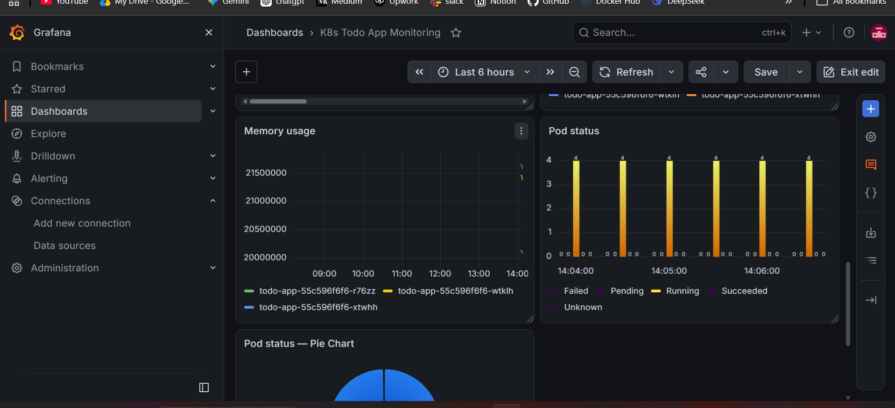
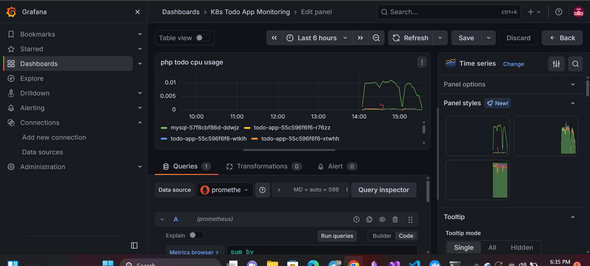
---


# 50. Expected Monitoring Components

At the end, the namespace should contain components similar to:

```text
monitoring
│
├── prometheus
│   ├── Deployment
│   ├── Pod
│   └── Service
│
├── grafana
│   ├── Deployment
│   ├── Pod
│   └── Service
│
├── cadvisor
│   ├── DaemonSet
│   ├── Pods
│   └── Service
│
└── kube-state-metrics
    ├── Deployment
    ├── Pod
    └── Service
```

---

# 51. Useful Monitoring Commands

## Check everything

```bash
kubectl get all -n monitoring
```

## Check Pods

```bash
kubectl get pods -n monitoring -o wide
```

## Check Services

```bash
kubectl get svc -n monitoring
```

## Check Deployments

```bash
kubectl get deployments -n monitoring
```

## Check DaemonSets

```bash
kubectl get daemonsets -n monitoring
```

## Check ConfigMaps

```bash
kubectl get configmaps -n monitoring
```

## Check PVCs

```bash
kubectl get pvc -n monitoring
```

---

# 52. Troubleshooting — Prometheus Pod Not Running

Check:

```bash
kubectl get pods -n monitoring
```

If the Pod is:

```text
Pending
```

describe it:

```bash
kubectl describe pod <prometheus-pod> -n monitoring
```

Look at:

```text
Events
```

Possible causes include:

```text
Insufficient resources
PVC Pending
Scheduling problems
Configuration errors
```

---

# 53. Troubleshooting — Prometheus Has No Data

First check:

```bash
kubectl get pods -n monitoring
```

Then check Prometheus targets in:

```text
Status → Targets
```

If a target is:

```text
DOWN
```

check the target's error message.

Also check Prometheus logs:

```bash
kubectl logs -n monitoring deployment/prometheus
```

---

# 54. Troubleshooting — Grafana Cannot Connect to Prometheus

Check the Prometheus Service:

```bash
kubectl get svc prometheus -n monitoring
```

Check Prometheus:

```bash
kubectl get pods -n monitoring -l app=prometheus
```

From inside the Grafana Pod, test DNS/network connectivity.

First find the Grafana Pod:

```bash
kubectl get pods -n monitoring -l app=grafana
```

Then:

```bash
kubectl exec -it <grafana-pod> -n monitoring -- \
  curl http://prometheus:9090/-/healthy
```

A healthy Prometheus instance should return a successful response.

---

# 55. Troubleshooting — cAdvisor Pods Are Missing

Check:

```bash
kubectl get daemonset -n monitoring
```

Then:

```bash
kubectl get pods -n monitoring -o wide
```

If cAdvisor is running only on the workers:

```text
desktop-worker
desktop-worker2
```

but not:

```text
desktop-control-plane
```

check the control-plane taints:

```bash
kubectl describe node desktop-control-plane | grep Taints
```

A kubeadm control plane commonly has a taint similar to:

```text
node-role.kubernetes.io/control-plane:NoSchedule
```

If monitoring the control plane is required, the cAdvisor DaemonSet needs an appropriate toleration.

---


# 60. Final Monitoring Architecture

The completed DevOps environment now looks like:

```text
                         GitHub
                            │
                            ▼
                     ┌────────────┐
                     │   Jenkins  │
                     └─────┬──────┘
                           │
                    Docker Build
                           │
                           ▼
                      Docker Hub
                           │
                           ▼
                ┌─────────────────────┐
                │ Kubernetes Cluster  │
                │                     │
                │ desktop-control     │
                │ desktop-worker      │
                │ desktop-worker2     │
                └──────────┬──────────┘
                           │
                    Application Pods
                           │
                           ▼
                       cAdvisor
                           │
                           │ metrics
                           ▼
                      Prometheus
                           ▲
                           │
                  kube-state-metrics
                           │
                           │
                           ▼
                        Grafana
                           │
                           ▼
                    Monitoring Dashboard
```

---


The only thing left now is add webhook to jenkins so we don't have to click build button on jenkins, Jenkins will automatically triggered when there is new push to the github. 
So To do that check out the next file name with 'Jenkins Automation.md'

This gives the PHP Todo project a much more complete **end-to-end DevOps architecture** suitable for demonstrating  Kubernetes, Jenkins, containerization, CI/CD, and monitoring technics.
